#  InDesign for Efficient and Beautiful Figure-making  

### What is InDesign?  
Adobe InDesign is a layout and page design app. It can be (and in many cases, should be) used in conjunction with its graphic-design-savvy cousin, Adobe Illustrator. InDesign is a powerful software, and there are endless tips and tricks you can find online. Here, I'll go over a very basic workflow that has helped my figure-making be more automated and reproducible.

### What is InDesign good for?
InDesign is amazing for **multi-panel figures**: you can lay out each panel, align objects, and add text (i.e. correlations, p-values, panel labels) in just a few clicks. Best of all, InDesign makes updating figures *PAINLESS*!! I also like using InDesign for making **posters** because of how much easier it is to layout and align figure/text objects than Illustrator. 

### What is InDesign NOT so good for? 
InDesign is NOT good for creating or editting details of a graphic - leave graphic design (or manipulating details of your figures) to good ol' Illustrator. 

## Table of Contents
1. [Install InDesign](#Install-InDesign)
2. [Set Up Your First InDesign Document](#Set-Up-Your-First-InDesign-Document)
3. [Brief Overview of Relevant InDesign Tools](#Brief-Overview-of-Relevant-InDesign-Tools)
4. [Example of a Simple InDesign Workflow ](#Example-of-a-Simple-InDesign-Workflow)

## 1. Install InDesign
You can download InDesign via Adobe Creative Cloud, which I believe you should have access to through Penn. You may already have Creative Cloud if you have Illustrator on your computers. If you don't have Creative Cloud, you can download InDesign [here](https://helpx.adobe.com/indesign/get-started.html)

## 2. Set Up Your First InDesign Document
I typically make one InDesign document for each multi-panel figure. After opening up InDesign, click "New File". You can choose your document size, which will depend on how big you want to figure to be. Nature, for example, suggests preparing figures to fit PDF page size: 210 x 276 mm. We will work with this figure size in this tutorial.

Toggle your units to "mm", and enter your figure width and height. 
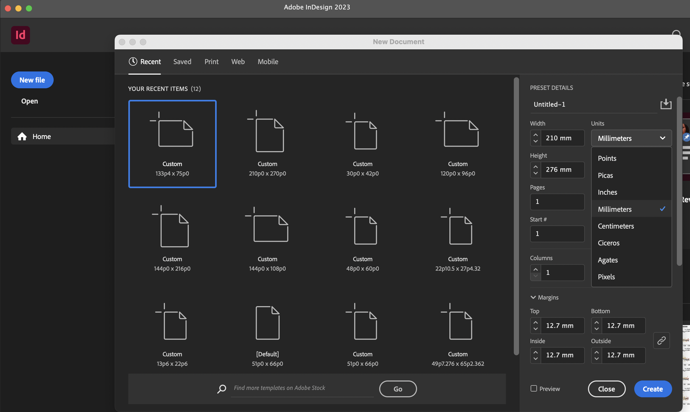

Click "Create", and voilà! You now have a brand new document where you can build your figure.

I typically work under the "Normal" view that shows all the guides and bounding boxes (View > Screen Mode > Normal). You can switch to View > Screen Mode > Preview when you want to view without guides/boxes.

## 3. Brief Overview of Relevant InDesign Tools
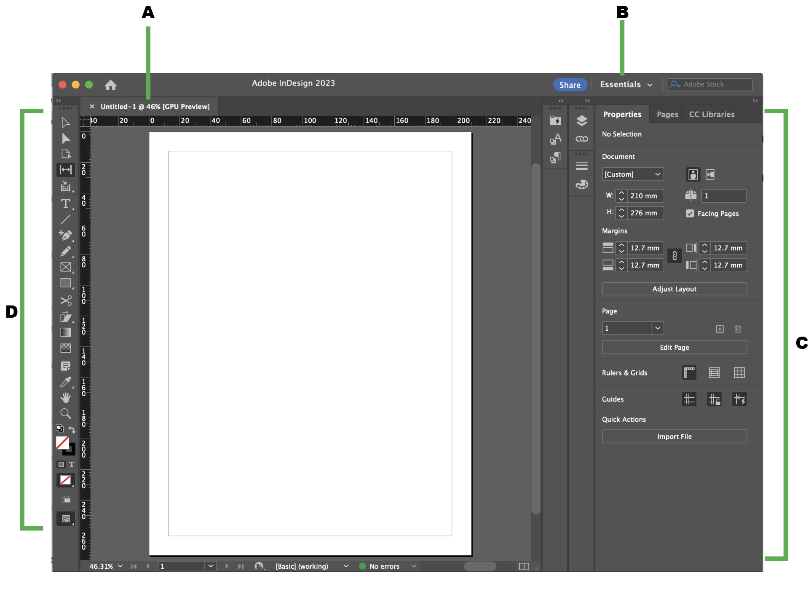

A. Tabbed Document windows (you can have multiple documents open at the same time) \
B. Workspace switcher (I like to work in "Essentials" - a minimalist setup that's easy to navigate) \
C. Control panel (different options appear depending on whether you are highlighting an object or not) \
D. Tools panel (tools for editing images and page elements)

Diagram adapted from [Adobe](https://helpx.adobe.com/indesign/using/workspace-basics.html).

Let's zoom into the **Toolbar** to introduce these bad boys: 

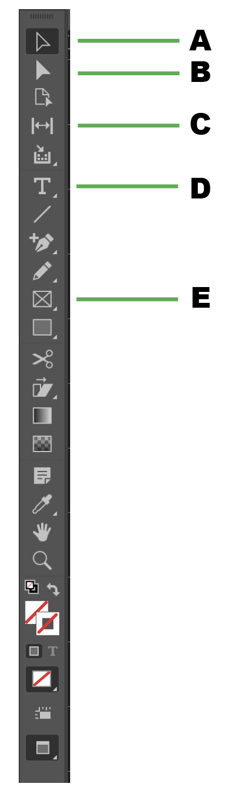   

A. **Selection Tool**: Allows you to select text and graphics frames work. You can work with an object using its bounding box. Notice that when you click an object using the Selection Tool, additional options will show up in the Control Panel on the right (under the Properties tab).  

B. **Direct Selection Tool**: Allows you to select the contents of a frame (like a placed graphic). I don't use this tool as much for our figure-making purposes, but feel free to play around with it. 

 
C. **Gap Tool**: Measures and adjusts the gap between objects (can be helpful in trying to make sure objects are evently distributed). **Note**: the Gap Tool measures based on the bounding box, so if you have a lot of white space between your image and bounding box, you may not get the best measurement. I don't use the Gap Tool that often, but it is nifty. \
    - **Click** the space between two objects to measure.\
    - **Shift-drag** to move the gap between only the two nearest objects.\
    - **Ctrl-drag (Windows) or Command-drag (Mac OS)** to resize the gap instead of moving it. Adding the **Shift** key resizes the gap between only the two nearest objects.

D. **Type Tool**: Click and drag to add a new text frame to the document. Note that if you can't just click and start typing, you have to click and drag to create a 'text frame'. Or click in an existing text frame to add text. If you edit a text frame using the **Type Tool**, additional options will pop up in the **Control Panel** on the right. If you select a text frame using the **Selection Tool**, DIFFERENT options will pop up in the Control Panel. 
 
E. **Rectangle Frame Tool**: Arguably the most important tool in InDesign for our purposes! This tool creates placeholders for the images/objects/text that you will put in your final figure. You use this tool to essentially create a skeleton or layout of what your panels will look like. After creating that skeleton, you can place images into those placeholders. \
    - Hold **Shift** while clicking/dragging with the Rectangle Frame Tool to create a square frame. \
    - To place image, first select the frame, then do File > Place. If you're lazy, you can also click and drag. Once you place an object, that frame is now linked to that file. So if you change that file (i.e. edit it in Illustrator or completely make a new version of it in R or Python), InDesign will prompt you to update that frame. Updating the frame literally takes ONE click!!\
    - You need to know how big your figures are so you can draw an appropriately sized frame. Or you can draw an approximate frame, place the image, then tweak the placed image to get it to fit right. See Workflow below for details. 
 
   

Last but not least, let's get you familiar with a few entities on the **Control Panel** (usually on the right of the workspace)
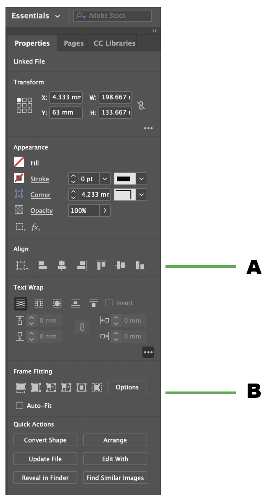  
If you use the **Selection Tool** and click an object you want to  manipulate, you will see some additional options appear on the Control Panel as below. 

A. **Align**: These buttons help you easily align objects with just one click! You can hover over the icons to see what kind of alignment each does. \
B. **Frame Fitting**: Helps manipulate placed images and text. \
    - *Auto-Fit*: I strongly suggest always having Auto-Fit selected; this allows the image to be resized as you resize the frame. If you have Auto-Fit deselected, you essentially are working with a crop tool, where you can resize the frame while the image inside is static. \
    - *Fill frame proportionally* and *Fit content proportionally*: the first two little squares in this row. I tend to use one of these to make sure my placed image fits the frame just right and to reduce white space.  

                          

## 4. Example of a Simple InDesign Workflow
A few principles to keep in mind as we start figure-making in InDesign:
* Have your figure layout already sketched out either on paper or Powerpoint or in your mind's eye. Don't jump into InDesign without already knowing how you want your figure to look. 
* To maximize automation, reproducibility, and consistency, try to make sure the images you save out from RStudio or Python look as close to the final figure panel as possible. For example, have your labels, tick marks, image size, etc. be as clean as possible. It is fine for you to save out each panel separately; you can also save them out in a grid arrangement (via packages like cowplot, ggarrange, etc. in R) that reflects what you want for your final product. 
* If there are things you can't automate for your figures in RStudio or Python, for example getting subscripts to be formatted correctly (i.e. *p*spin) or editing or formatting legends, you can do those things in Illustrator. Just remember to save out as a PDF.
* InDesign is the last leg in making your figures. Making sure everything upstream is correct will make your life easier. But if you end up having to remake figures (as we inevitably do during manuscript prep, revisions, etc.), updating your InDesign layout with new figures will be far less of a headache than doing so in Illustrator and other tools!!

OKAY! We are now ready to jump into an example of a simple InDesign workflow for figure-making!!

### Our goal is to make this figure: 

    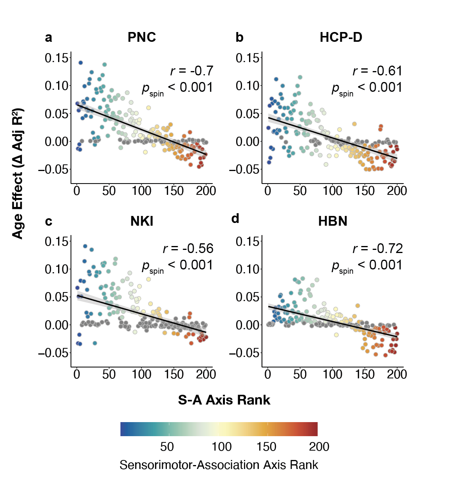

 

### First, make sure your output folder is set up. 
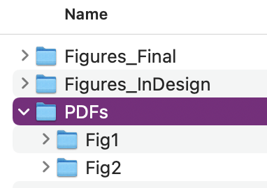  

I like having 3 sub-folders, one for outputting my figures from RStudio (PDFs), one for my InDesign files (.indd), and one for my final figures (PDFs or PNGs). If you need to adjust anything in Illustrator before loading things into InDesign, I usually just edit the RStudio PDFs directly in Illustrator and write over the original file. In my PDFs directory, I will have individual sub-folders for each figure (Fig1, Fig2, etc.) that contain all the panels I need for a given figure, including separate files for legends.

      

### Plot figures in RStudio (or Python or Matlab!) + save out as PDFs

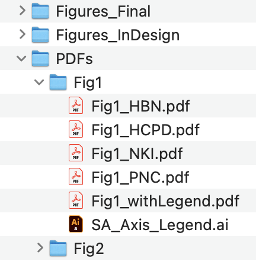   
Save each panel as a PDF in the appropriate folder (e.g. `/dataclub/PDFs/Fig1/Fig1_<dataset>.pdf`). See InDesign_Tutorial_Figures.Rmd for code. **Note**: I've excluded the x and y axis labels from these panels because I don't want them in the final figure; my plotting function also excludes a legend. My saved-out panels look something like this:

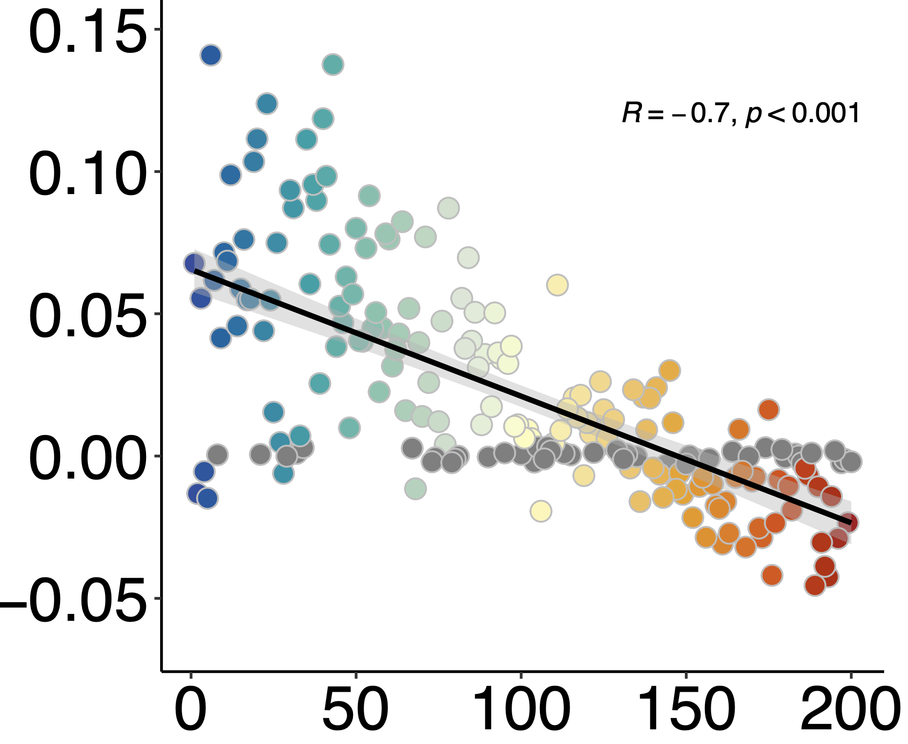 

You will also need the legend. To do this, you can simply plot a version WITH the legend and save out. I won't go over how to crop out the plot and edit the legend in **Illustrator**, since I'm assuming many of you already have familiarity with that app. I saved out my Illustrator file as `SA_Axis_Legend.ai`. The legend looks like this: 

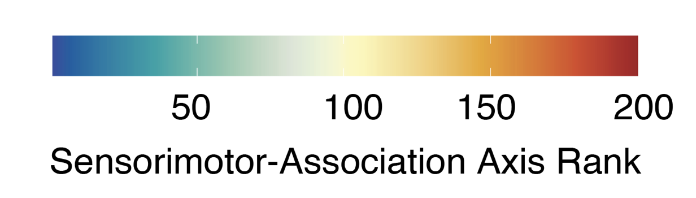 

### Now it's time to jump into InDesign!

Set up your document (210 x 276 mm, since we're making a figure for an imaginary Nature submission). Make sure you know what color format your journal requires. Nature recommends RGB but can also take CMYK. To edit these settings, go to Edit > Transparency Blend Space > Document RGB or Document CMYK. 
#### 1. First, set up the frames where you will place each object.
Using the **Frame Tool**, click and drag to create a large rectangle where your work will go. While holding the click, press the **right/left** button to add/remove columns and press **up/down** to add/remove rows. Add additional boxes for the legend and axis titles. You can align your boxes by selecting the boxes (**Select Too**) then choosing an **Align option** in the **Control Panel**. 

*Note*: no need to be perfect in the sizing of your frames. Definitely helps to be more accurate with aspect ratio, but we can tweak frames later! 

<video width="800" controls>
  <source src="FramesSetUp.mov" type="video/mp4">
</video> 

*Note* you can also [create guides](https://helpx.adobe.com/indesign/using/ruler-guides.html) that help you line up images by clicking and dragging the X or Y axis ruler. (Not shown in video.) 
#### 2. Next, place the plots into each frame.
This can be done by **dragging and dropping** (see video), or **select each frame, then File > Place > image.pdf.** Notice that the placed images are UGLLYY, like they do not fit right. That is ok!!  

After placing all your plots, you can select all of them (**shift + Select Tool**; make sure the boxes are blue not yellow! Yellow = direct selection tool). Scroll to the **Control Panel's frame fitting section**, and click the **appropriate fit**. I chose "Fit Content Proportionally" because that looks best.  

Now, you have a gorgeous initial layout of your figure in < 2 minutes. No resizing each plot, no shifting plots up and down to make them line up, etc!!

<video width="800" controls>
  <source src="Place.mov" type="video/mp4">
</video> 

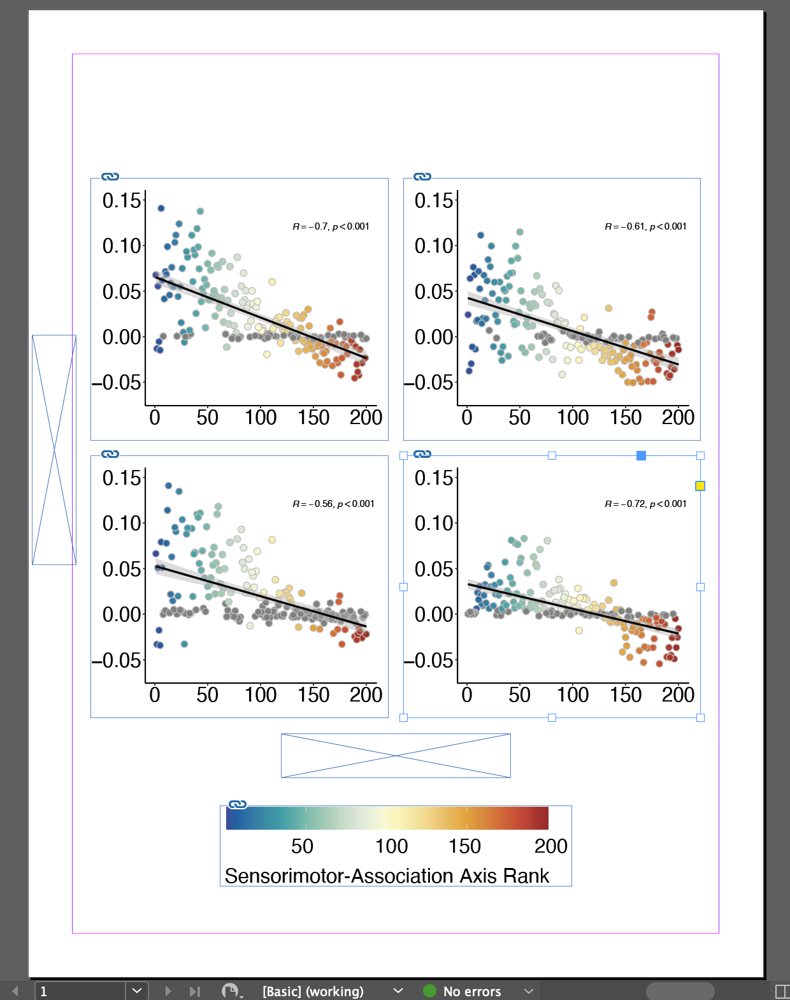 

    <em>Product of exactly 1 min 52 seconds of work in InDesign! YAYYY!!</em>

#### 3. Now, we can add panel labels and text. 
Using the **Frame Tool**, we can make placeholders for panel labels (a, b, c, d) and titles (dataset names). We can copy and paste each pair of frames (label + title) for each panel so they're all the same size. We can also make sure that the frames are all aligned by selecting pairs of frames and clicking the appropriate alignment in the **Control Panel**. 

Next, type in the text for each frame using the **Type Tool**. After typing, use the **Selection Tool** to highlight all the boxes you want to format and choose a desired font and size. 

Notice that one of the text boxes has a little red "X" next to it and the text has disappeared. This is because the text box isn't big enough to display the entire text string. In this case, simply use the **Selection Tool** to resize. 

Once you have all the text boxes selected, you can also center align the text in the **Control Pane**. Be careful not to scroll your mouse or InDesign might scroll you through a bunch of fonts (2:01 in the video below - oops!). Instead, click and drag the scroll bar in the **Control Pane**. To center your text in the vertical direction, scroll down to **Text Frame** in the **Control Panel** while your text boxes are still selected > Options > Align: Center (under Vertical Justification) > OK. 

<video width="800" controls>
  <source src="Text.mov" type="video/mp4">
</video> 

Let's add a delta symbol and superscript to our y-axis. Symbols can be added via Type (ribbon) > Glyphs. Super- and sub-scripts can be added using the **Control Pane** while utilizing the **Type Tool**.

<video width="800" controls>
  <source src="SubscriptsSymbols.mov" type="video/mp4">
</video> 

We can also add correlations and p-values to each plot. I like to add them manually in InDesign because I can't format *p*spin properly in R. 

Using the **Type Tool**, draw a text box in the plot and type the correlation and p-value. To make the textbox opaque, select the text box and in the **Control Panel** under **Appearance**, click Fill > Paper. Then, select the correct font and left alignment (**Control Panel** > Paragraph). Using the **Type Tool**, highlight the "r" and "p" and italicize as appropriate. 

You can copy/paste this textbox to each plot, edit the text, and align as needed. Notice that when moving the boxes around, green guide lines sometimes automatically appear, telling you whether or not you are aligned with other elements or centered. These are super helpful!! 

<video width="800" controls>
  <source src="Correlation.mov" type="video/mp4">
</video> 

#### 4. Add your finishing touches
To view your piece without guides, go to **View** (ribbon) > Screen Mode > Preview. Make final edits as needed (i.e. changing up the font and sizes, fixing alignment and spacing, etc.)

<video width="800" controls>
  <source src="FinishingTouches.mov" type="video/mp4">
</video> 

### What if you have to remake all your panels?!?
We often have to remake figures after incorporating co-author's comments or during paper revisions. This can lead to a frustrating amount of work recapitulating multi-panel figures that we meticulously laid out in Illustrator or another program. Sad times.

**In InDesign, it takes one click!!** This is literally my favorite thing about InDesign. 

Say I want to update my figures to be a totally different color scheme - purple and yellow, in honor of Val :) I need to regenerate the figures in RStudio and save out with the **same filenames** (replacing the original ones I had). It is important for the filenames to be the same since each frame in the InDesign document is linked to a given filepath. 

After saving out the new plots, make sure InDesign is closed. Reopen the InDesign document, and you should get this error message: 

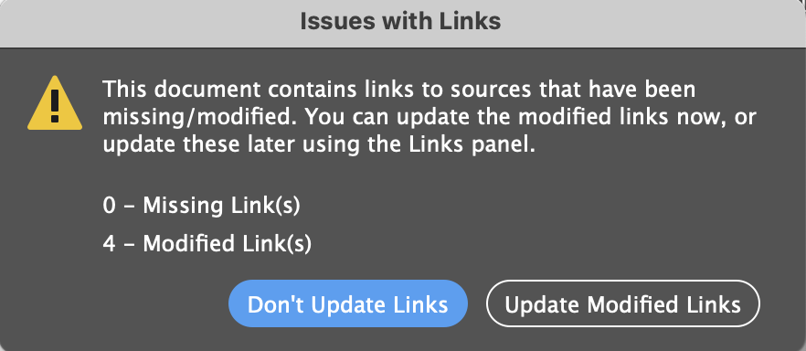 

Click "Update Modified Links", and let InDesign do its magic!!!!!

<video width="800" controls>
  <source src="Magic.mov" type="video/mp4">
</video> 

 
Note that you still need to update the legend in Illustrator. I would rename the original Illustrator file for the legend with an "_old" tag, and save the purple-yellow legend with the original filename. Then update InDesign:

<video width="800" controls>
  <source src="UpdateLegend.mov" type="video/mp4">
</video> 

View the document using "Normal" (View > Screen Mode > Normal) and click the little caution icon by the legend to update the link. And you're done!!

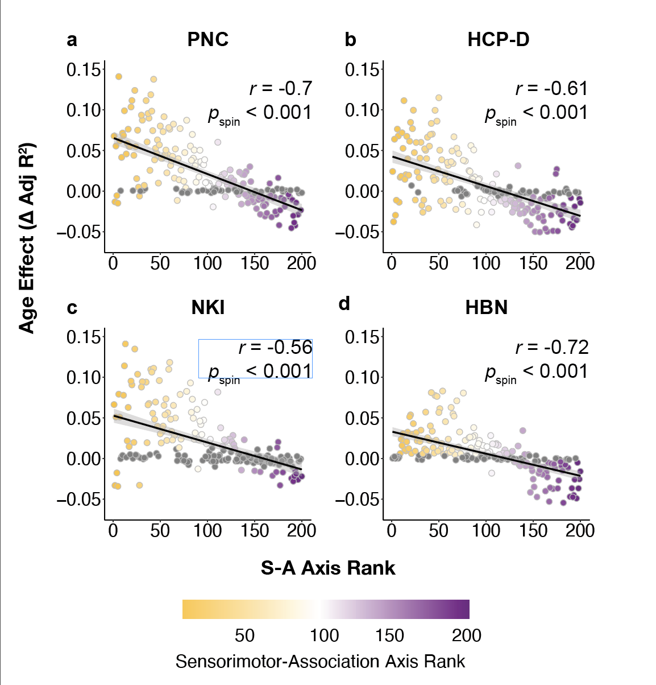 

    <em>The fastest outfit change that ever was</em>

### Save your work
You can save your InDesign document as an .indd file for future editing. To save figures for manuscripts, you can do File > Export > PNG, Adobe PDF, etc. 